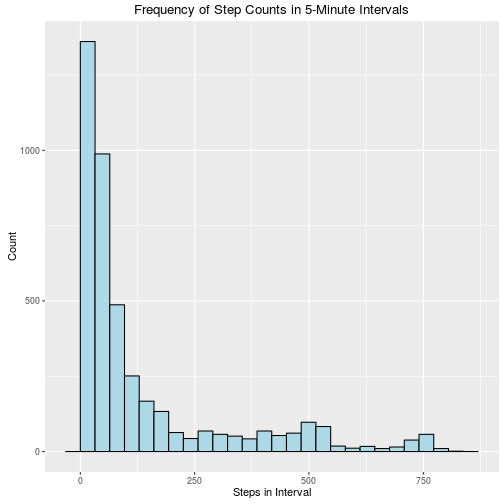
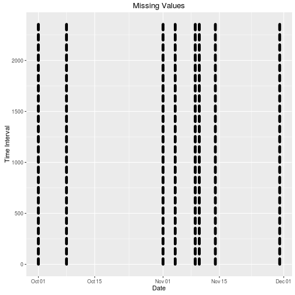
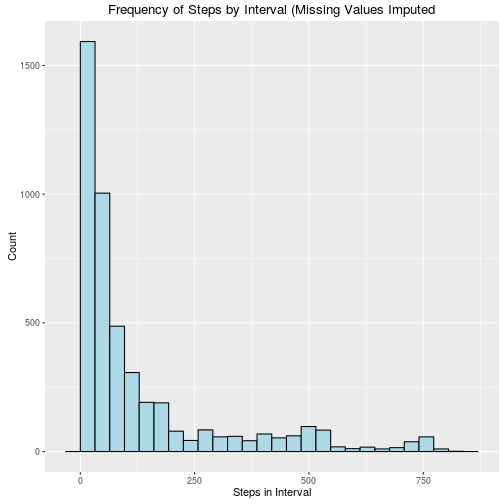

## Summary

We examined movement data from a personal activity tracker for sixy-one days, polled at five-minute intervals.

We identified and imputed values for missing data without significantly distorting the data set.

We examined for an identified patterns of movement over the course of the day, and different patterns between weekdays and the weekend. We recommend this difference as an avenue for further analysis.

## Methods


### Data Preparation

We loaded the Activity Monitoring Data Set and formatted the date column correctly.

```r
wData <- read.csv("./activity.csv")
wData$date <- as.Date(wData$date, "%Y-%m-%d")
```

### Exploratory Analysis

Analyzed the Activity Monitoring Data Set for trends and patterns. We identified gaps in the data set and imputed values for the missing data, and determined the impact of our approach for imputing values on the quality of the data. We plotted mean activity levels by time interval to identify trends over the course of the day, and identified potential differences between weekend and weekday activity patterns.

## Findings

### Daily Activity Patterns

We examined the frequency of steps, and found most intervals to be less than 100 steps per interval.

```r
# Note: 11,014 0-count intervals are excluded
ggplot(data = wData[!is.na(wData$steps) & wData$steps > 0,],
       aes(x = steps))+
  geom_histogram(col = "black", fill = "lightblue", bins = 25) +
  scale_y_continuous(name = "Count") +
  scale_x_continuous(name = "Steps in Interval") +
  ggtitle("Frequency of Step Counts in 5-Minute Intervals")
```

 

We calculated the mean, median and standard deviation of steps per day:

```r
wData %>%
  group_by(date) %>% 
  summarize(steps = sum(steps, na.rm = T)) %>% 
  ungroup() %>% 
  summarize(mean_steps = mean(steps), median_steps = median(steps),
            sd_steps = sd(steps, na.rm = T))
```

```
##   mean_steps median_steps sd_steps
## 1     570608       570608       NA
```
To identify patterns of movement over the course of the day, we examined the mean number of steps by interval.

```r
# Summarize daily steps
dailyData <- wData %>% 
  group_by(interval) %>% 
  filter(!is.na(steps)) %>% 
  summarize(mean_steps = mean(steps))
# Plot steps over intervals
ggplot(data = dailyData, aes(x = interval, y = mean_steps))+
  geom_line(stat = "identity", col = "black") +
  scale_x_continuous(name = "Interval") +
  scale_y_continuous(name = "Mean Steps")+
  ggtitle("Mean Steps by Interval")
```

```
## Error in eval(expr, envir, enclos): object 'interval' not found
```

 
We found the mean step count during five-minute intervals to range from 0 (we presume during sleeping) to a max of 206.17 steps during the 835th interval

```r
max(dailyData$mean_steps)
```

```
## [1] 37.3826
```

```r
dailyData$interval[dailyData$mean_steps == max(dailyData$mean_steps)]
```

```
## NULL
```

### Imputing Missing Values
Examining the data set for missing values, we noted missing values for step counts in 8 of the 61 days in the data set.


```r
ggplot(data = wData[is.na(wData$steps),], aes(x = date, y = interval)) +
  geom_point()+
  ggtitle("Missing Values") +
  scale_x_date(name = "Date") +
  scale_y_continuous(name = "Time Interval")
```

 
Observing the data were missing for all intervals in each of the eight days, we chose to impute the median values for steps from the same intervals in other days.

```r
# Spread the steps values across a matrix
impData <- spread(wData, interval, steps)
# Impute steps values for NA variables by calculating median steps for the
# intervals accross the days
impData <- impute(impData, what = "median")
impData <- data.frame(impData, stringsAsFactors = F)
impData$date <- as.Date(impData$date, "%Y-%m-%d")
impData[,2:289] <- mapply(as.integer, impData[,2:289])
names(impData) <- sub("X", "",names(impData))
impData <- gather(impData, key = date, value = steps)
names(impData)[2] <- "interval"
impData$interval <- as.numeric(as.character(impData$interval))
```
We compared the median and mean to the original data set, and found that this did not significantly impact the distribution of step counts. This indicated that we did not skew the data with our approach for imputing missing values.

```r
ggplot(data = impData[!is.na(impData$steps) & impData$steps > 0,],
       aes(x = steps))+
  geom_histogram(col = "black", fill = "lightblue", bins = 25) +
  scale_y_continuous(name = "Count") +
  scale_x_continuous(name = "Steps in Interval") +
  ggtitle("Frequency of Steps by Interval (Missing Values Imputed")
```

 

```r
# Calculate mean and median steps per day

# Steps per Day
impData %>%
  group_by(date) %>% 
  summarize(steps = sum(steps, na.rm = T)) %>% 
  ungroup() %>% 
  summarize(mean_steps = mean(steps), median_steps = median(steps),
            sd_steps = sd(steps, na.rm = T))
```

```
##   mean_steps median_steps sd_steps
## 1     604880       604880       NA
```

### Weekend Activity Patterns
To explore potential differences in activity patterns between weekdays and weekends, we coded a day type variable and compared the mean acitivity levels.

```r
impData <- mutate(impData, day_type = ifelse(
  weekdays(date) %in% c("Saturday", "Sunday"),
  "weekend",
  "weekday"
  ))

# Summarize the mean step count for the intervals
dayType <- impData %>% 
  group_by(day_type, interval) %>% 
  summarize(mean_steps = mean(steps))

ggplot(dayType, aes(x = interval, y = mean_steps))+
  geom_line(stat = "identity", col = "black") +
  scale_x_continuous(name = "Interval") +
  scale_y_continuous(name = "Mean Steps") +
  ggtitle("Activity Level by Day Type") +
  facet_grid (day_type ~ .)
```

```
## Error in layout_base(data, rows, drop = drop): At least one layer must contain all variables used for facetting
```

 

## Conclusion

We found discernible differences in activity levels over the course of a day. We also find taking a median activity level to be an effective method for imputing missing data values.

We find the difference in activity patterns between weekdays and weekends to be an interesting avenue for further research.
